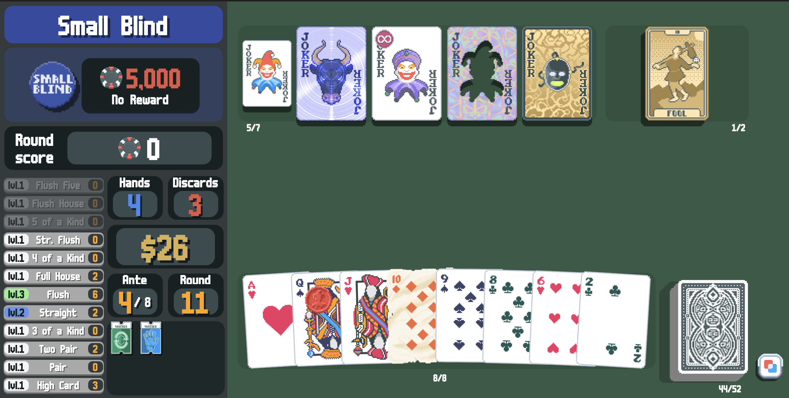

# python-balatro

## AI Training with PPO

This project has been [forked](https://github.com/pjpuzzler/python-balatro) and extended with a complete **PPO (Proximal Policy Optimization)** training system for AI agents.


A Python implementation of the hit roguelike deckbuilder [**Balatro**](https://www.playbalatro.com) by LocalThunk. This project captures the core gameplay mechanics of Balatro and provides a complete reinforcement learning environment for training AI agents.

### 🤖 AI Features

- **Complete PPO Implementation**: Based on CleanRL with full training pipeline
- **Complex Action Space**: Handles 17 action types with multi-parameter selection
- **Rich State Representation**: ~10,500 dimensional game state encoding
- **Parallel Training**: Multi-environment support for efficient learning
- **Advanced Rewards**: Sophisticated reward engineering for strategic play
- **Model Evaluation**: Comprehensive testing and analysis tools

### 🚀 Quick Start - AI Training

```bash
# Install dependencies
pip install torch tensordict torchrl numpy tensorboard

# Test setup
cd ai && python test_basic_setup.py

# Start training
python ppo_balatro.py --total-timesteps 500000 --num-envs 4

# Evaluate trained model  
python evaluate_ppo.py models/ppo_balatro_1000.pth --episodes 10
```

📖 **Complete Setup Guide**: See [`SETUP_PPO.md`](SETUP_PPO.md) for detailed instructions
📚 **AI Documentation**: See [`ai/README.md`](ai/README.md) for technical details

**Note:** This is a work in progress. While the majority of core features are functional, there are likely bugs and things left to be tested.



## Important Considerations

-   **Not a 1:1 Translation:**

    -   Little to no design patterns were reused from the game's code (written in Lua). This was done for several reasons, including:
        -   To maintain a natural and _Pythonic_ approach
        -   To challenge myself to write a unique implementation
        -   To avoid sifting through thousands of lines of code (i.e. my sanity)

-   **Bugs/Edge Cases:**

    -   As a result of this, there will likely be very subtle differences between this module and the actual game.
    -   I encourage you to report any problems/inconcistencies you find in the [**Issues**](../../issues) tab.

-   **Seed Incompatibility:**

    -   Likewise, seeds are **not** compatible between this module and the actual game, perhaps a project for a future date.

## Getting Started

```python
from balatro import *
```

```python
# Create a new run with the Yellow Deck on White Stake
run = Run(Deck.YELLOW, stake=Stake.WHITE)

run  # Rich Jupyter Notebook display
```


```python
# Alternatively, manually get information about the current state
print(f"Current Ante: {run.ante}")
print(f"Current Blind: {run.blind.value}")
print(f"Current Money: ${run.money}")
```

> Current Ante: 1\
> Current Blind: Small Blind\
> Current Money: $14

```python
# Select the Small Blind
run.select_blind()
# Or skip it
# run.skip_blind()

run
```


```python
# Play the flush
run.play_hand([0, 1, 2, 4, 6])
# Alternatively, discard
# run.discard([3, 4, 6])

run
```

WIP: Cashing Out Screen

```python
# Continue to the shop
run.cash_out()

run
```


```python
# Buy the Hallucination joker
run.buy_shop_card(0, 0)  # (item index, use (if consumable))

# Buy the Voucher
# run.redeem_shop_voucher(0) # (item index)

run
```


```python
# Open the Buffoon Pack
run.open_shop_pack(0) # (item index)

run
```


```python
# Take the Blueprint
run.choose_pack_item(0)
# Or skip the pack
# run.skip_pack()

# Move the Blueprint to the left
run.move_joker(1, 0)

# Use the Hermit
run.use_consumable(0)

# Proceed to the next round
run.next_round()
```

## Disclaimer

This project is an independent fan creation and is not affiliated with or endorsed by LocalThunk, the creator of Balatro. This module is intended for educational and non-commercial purposes only. All rights to Balatro, including its art and design, belong to LocalThunk.
